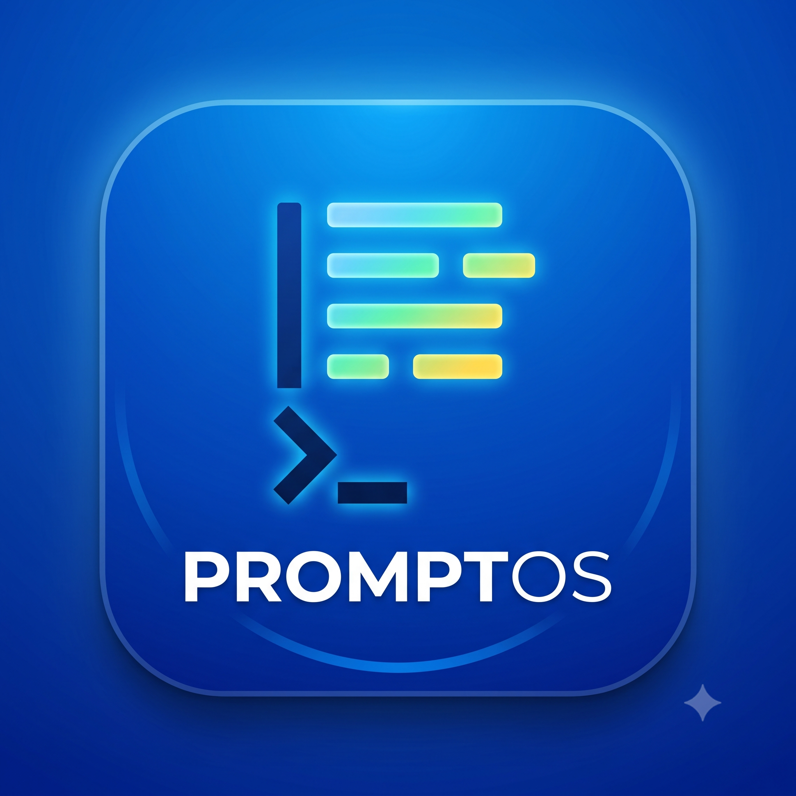
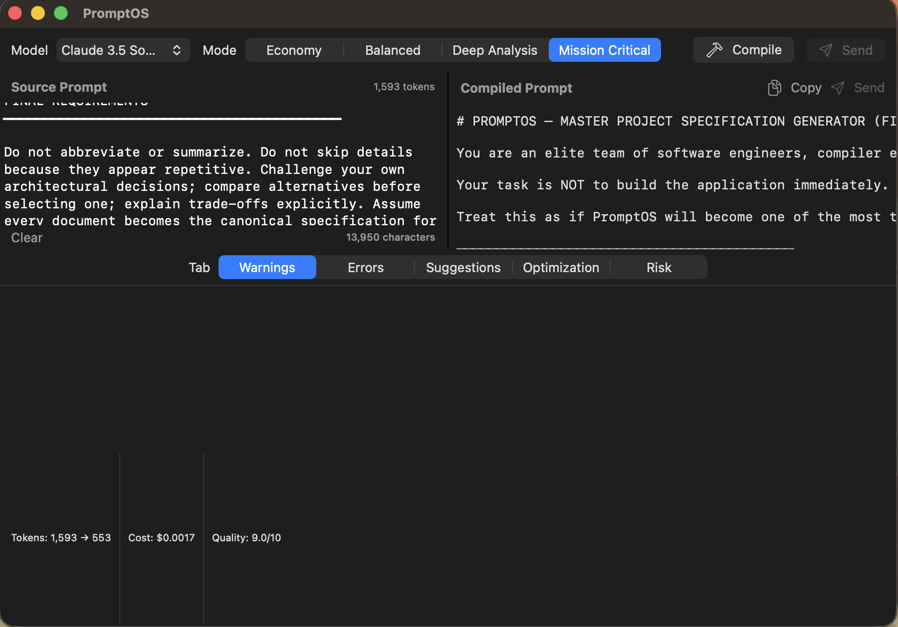
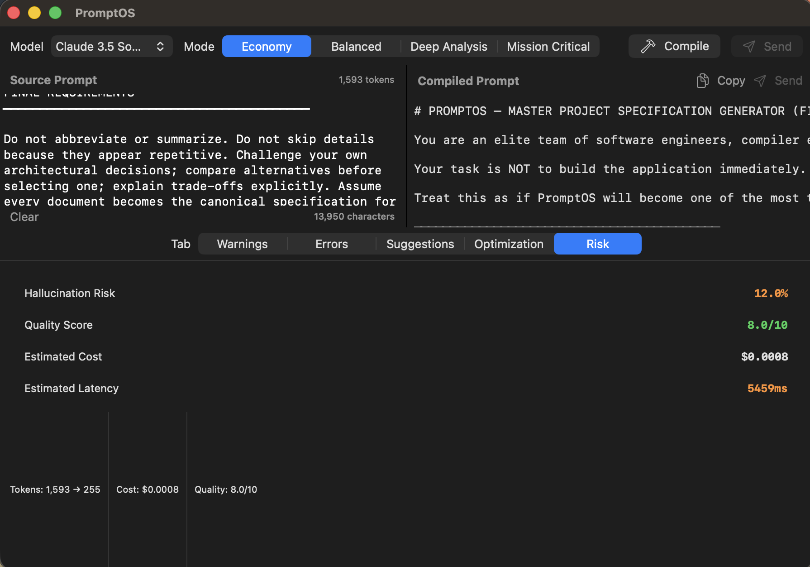
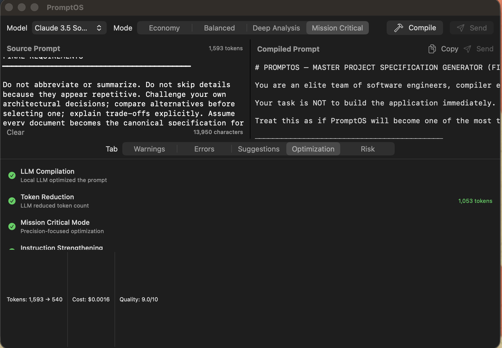

# PromptOS — The Prompt Compiler

<p align="center">
  
</p>

PromptOS is a macOS desktop application that treats human-written prompts as source code, compiles them through a rigorous multi-pass optimization pipeline, and produces model-specific, quality-assured, cost-optimized prompts for frontier LLMs.

## Architecture

```
┌──────────────────────────────────────────────────────┐
│                  PromptOS Application                 │
│  ┌──────────┐  ┌──────────────────┐  ┌────────────┐ │
│  │  UI       │  │  Compiler Core   │  │  Inference │ │
│  │  (Swift)  │◄─┤  (Rust)          │◄─┤  (llama)   │ │
│  └──────────┘  └──────────────────┘  └────────────┘ │
│                      │                                │
│  ┌──────────────────────────────────────────────────┐ │
│  │              Service Layer                        │ │
│  │  Keychain | Profiles | History | Plugins (WASM)  │ │
│  └──────────────────────────────────────────────────┘ │
│                      │                                │
│  ┌──────────────────────────────────────────────────┐ │
│  │              Network Layer                        │ │
│  │  Provider API | Profile Registry | Updates       │ │
│  └──────────────────────────────────────────────────┘ │
└──────────────────────────────────────────────────────┘
```

## Features

- **Multi-mode compilation**: Choose from Balanced, Economy, Deep Analysis, or Mission Critical modes — each sends different optimization instructions to the LLM
- **Local LLM inference**: Bundled Qwen2.5-0.5B model via `llama-completion` with Metal GPU acceleration
- **Self-contained `.app`**: Zero external dependencies — all dylibs and model bundled inside the app
- **Rule-based fallback**: When LLM is unavailable, falls back to deterministic optimization passes
- **Cloud provider support**: API integration with Anthropic Claude, OpenAI GPT-4o, and Google Gemini
- **Plugin system**: WASM-based plugin runtime for custom optimization passes
- **Evaluation framework**: Benchmark suites, A/B testing, regression checking
- **History storage**: MessagePack + zstd compressed prompt history with indexed search

## Screenshots

<p align="center">
  
  
</p>
<p align="center">
  
</p>

## Quick Start

### Download

[Download PromptOS v1.0.0](https://github.com/Sneh30/promptos/releases/tag/v1.0.0) — unzip and run the `.app`, no setup required.

### Build from Source

**Prerequisites:**
- macOS 13 Ventura or later (Apple Silicon or Intel)
- Xcode 15+
- Rust toolchain (nightly or stable)

**Build:**

```bash
# Build all Rust crates
cargo build --workspace

# Run tests
cargo test --workspace

# Build and package the app
bash scripts/package.sh     # Creates .app bundle
```

**Distribute:**

```bash
ditto -c -k --keepParent swift/.build/PromptOSApp.app swift/.build/PromptOSApp-1.0.0.zip
```

## Project Structure

```
promptos/
├── crates/
│   ├── promptos-core/        # Compiler core (AST, lexer, parser, 10 optimization passes, codegen)
│   ├── promptos-llama/       # llama.cpp FFI bridge, C FFI, model downloader
│   ├── promptos-profiles/    # Model profiles & registry (Claude, GPT-4o, Gemini)
│   ├── promptos-history/     # Prompt history storage (MsgPack + zstd, BTreeMap index)
│   ├── promptos-plugin/      # WASM plugin runtime (load, unload, enable, disable)
│   ├── promptos-provider/    # Provider abstraction (Anthropic, OpenAI, Google)
│   ├── promptos-eval/        # Evaluation framework (benchmark suites, A/B, regression)
│   └── promptos-keychain/    # macOS Keychain integration
├── swift/Sources/PromptOSApp/ # SwiftUI application
├── scripts/                  # Build, sign, notarize scripts
├── plugins/                  # Example WASM plugins
├── screenshots/              # Application screenshots
└── Makefile                  # Build targets (build, test, package, dist)
```

## Compilation Modes

| Mode | Description | LLM Instruction |
|------|-------------|----------------|
| Balanced | Standard concise rewrite | Remove filler, strengthen weak phrases |
| Economy | Maximum token reduction | 50%+ token reduction, aggressive compression |
| Deep Analysis | Detail-preserving optimization | Add reasoning structure, preserve nuance |
| Mission Critical | Precision-focused | Verification criteria, clarity over brevity |

## License

Apache 2.0
